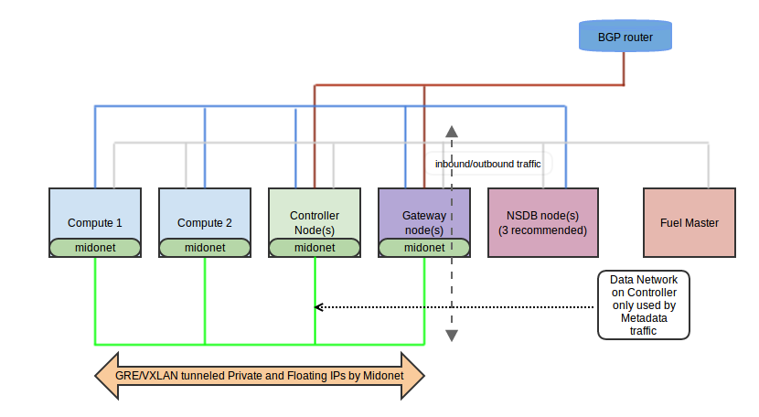

.. raw:: pdf

MidoNet Fuel Plugin User Guide
==============================

Short Introduction to MidoNet
-----------------------------

MidoNet changes the behaviour of default Neutron deployments, understanding
what MidoNet plugin does, especially in regard to external networks, is
essential to configure and use MidoNet Fuel plugin properly. MidoNet plugin is
compatible with both **Neutron + GRE** and **Neutron + VxLAN** network
tunnelling overlays, so let's focus on showing the differences between the
Neutron default ML2 deployments first.

Neutron without MidoNet plugin
``````````````````````````````

Fuel 7.0 reference architecture contains some useful information in
`Neutron Network Topologies`_ section. First, let's have an overview of
Neutron-default ML2 topolgy:

.. image:: ../images/fuelml2gre.png
   :width: 70%
   :align: center

In this topology, red, or "North" network represents the Public Internet,
including Floating IP subnet assigned to OpenStack cloud. That means API access
to services and Virtual Machines' Floating IPs share the same L2/L3 network.
This topology overloads the Controllers' traffic, since Neutron L3 agent
service is running on the controller, answers all ARP requests coming from
"North" traffic that belong to Virtual Machines' Floating IPs, does NAT on all
of the traffic destined to Floating IP assigned to Virtual Machines and places
the resulting packets in the overlay of the green, "South" network (br-tun).

Node hosting Neutron Controller has to:

- Serve the API requests coming from users
- Run the data and RPC messaging services (Rabbitmq and MySQL is running on the
  controllers as well)
- Handle all the North-South traffic that comes to and from the Virtual Machines.


Neutron with MidoNet plugin
```````````````````````````

With MidoNet, Neutron separates the control traffic from the data traffic.
Even the Floating IPs live in the network overlay. Floating IP subnet is
separated from the services API network range (called Public Network on Fuel
and represented by the red network below) and MidoNet gateway advertises the
routes that belong to Floating Ranges to BGP peers. So MidoNet plugin forces
user to define a new Network on its settings, and allocation-range from
environment settings get overridden.

MidoNet deployment topology:



On this topology diagram:

- **External Public & API networks** is the red one on the diagram. Only
  *Controllers* (access to OpenStack APIs and Horizon) and *Gateway* need
  access to this network. On the external side of this underlay we expect
  an ISP BGP router(s), ready to learn our OpenStack Floating IP subnet
  route so it can pass traffic to our virtual machines.

- **Private network** underlay is the green one on the diagram. All the traffic
  between virtual machines is tunneled by MidoNet on top of this network.
  Including traffic to and form floating IP addresses.

- **Management network** is the blue one. All nodes need to be connected to
  it, this network is used for access to *NSDB* nodes in order to access
  virtual networks topology and flow information.

- **PXE/Admin network** is the gray one. Needed by Fuel master to orchestrate
  the deployment.

- **Storage network** is not shown on the diagram, as it is out of scope of
  this guide (and Neutron & MidoNet itself).


MidoNet gateway in its BGP mode of operation is a native distributed system,
one can place as many BGP gateways as necessary, so North-South traffic can be
distributed and balanced. Once BGP sessions are established and routes are
exchanged between BGP peers, each North-to-South network packet gets routed
from the External Public API network to one of the MidoNet gateways.
It does not matter which of them gets the packet, they work as if they are a
single entity. MidoNet gateway sends the inbound packet directly to the Compute
that hosts the target virtual machine.

In this way controller nodes gets significantly less overloaded, since they
only need to answer user requests and they don't handle VM traffic at all.

Another MidoNet gateway mode of operation is to set up a single static routing
gateway, conceptually similar to the simple hardware gareway routers. Although
the plugin supports such setup, it would only establish one such gateway,
and consequently no redundancy or traffic balancing will be supported. This
kind of gateway setup is not recommanded in production and mission-critical
deployments, but may be suitable for lab or proof-of-concept deployments.

Following the learned concepts, we are ready to create a Fuel environment
that uses MidoNet.


MidoNet MEM Insights
````````````````````
The Midokura Enterprise MidoNet (MEM) add-ons offer additional functionalities
on top of the core MidoNet features, including Flow Tracing and Big Data
Analytics support. These tools provide means to collect system information that
can be used by the operator to visualize the network behavior.

These, as well as many other features are accessible via MidoNet manager,
a WEB front-end application that can manage many aspects of MidoNet network
topology that are usually not available in OpenStack or Neutron, provide
detailed visualization of network usage as well as provide important
troubleshooting tool. For more details see
`Midokura Enterprise MidoNet (MEM) MidoNet Manager Guide`_ and
`Midokura Enterprise MidoNet (MEM) Insights Guide`_


Create Environment
------------------

#. When creating the environment in the Fuel UI wizard, choose **Neutron with
   MidoNet** on the *Networking Setup* section:

   .. image:: ../images/tunneling.png
      :width: 75%
      :align: center

   After that, one will be able to choose between *GRE* or *VXLAN* encapsulation
   (Fuel WEB interface; Settings, Other section). MidoNet works with both of the
   encapsulation technologies, but VXLAN may offer better performance,
   especially for the deployments of a larger scale.

#. MidoNet plugin does not interact with the rest of the options, so choose
   whatever your deployment demands on them. Follow instructions from the
   `official OpenStack Fuel documentation`_ to finish the configuration.


Configure MidoNet Plugin
------------------------

Once the environment is created, open the *Settings* tab of the Fuel Web UI, and
go to the *Other* section:

   .. image:: ../images/other.png
      :width: 75%
      :align: center

Install Midokura Enterprise MidoNet (Optional)
``````````````````````````````````````````````

#. Installing Midokura Enterprise MidoNet, you will be able to use some specific
   features from MidoNet only available on the Enterprise version.

#. Activate the option **Install Midokura Enterprise MidoNet**. Optionally,
   activate Insights features if desired. Select the Midokura Enterprise
   MidoNet (MEM) version (5.2 or 5.4).

   .. image:: ../images/mem.png
      :width: 75%

#. Fill the MEM repository **Username** and **Password** fields required for
   downloading the MEM packages from the repository.

   .. image:: ../images/mem_credentials.png
      :width: 75%


Choose Tunnel Type
``````````````````

MidoNet tunnelling is compatible with **GRE** and **VXLAN**.


   .. image:: ../images/tunnel_type.png
      :width: 75%

Both are supported by MidoNet, but VxLAN is recommended for its performance.

Floating Network Options
````````````````````````

Configure the Floating fields of the plugin options (they are already been
filled by default, but you will need to change them for sure):


   .. image:: ../images/floating_network.png
      :width: 75%


Configuring the floating fields in *MidoNet plugin*, you will override most of
the options of the *Neutron L3/Floating Network Parameters* section of the
*Networks* tab of the environment.

So this *Floating IP range* (first row) will be completely ignored. This
range has to match with the *CIDR* of the *Public Network*, Which only will be
used for API-accessible IPs to the OpenStack services but not for Virtual
Machine's floating IPs.  Please refer to `Neutron with Midonet
plugin`_ section of this document if it is not clear enough to you.

Configure the Gateway
`````````````````````

#. Here we have three options, first of which is to configure the arbitrary number
of BGP gateways. For this one needs to fill the BGP attributes properly:

   .. image:: ../images/bgp_params.png
      :width: 75%

Special attention needs to be given to a formatting of a **BGP Peers** field.
This field can supply a comma-separated list of a BGP pairs, where each pair
is defined as:

   ::

    <local-peer-IP>/<bit-length-of-the-net-prefix>-<external-peer-IP>-<remote-AS>

Note that under normal conditions, local BGP peer means "local to MidoNet
deployment" and remote BGP peer means external, BGP router peer located at
the physical network underlay. In case one needs to set up external BGP peer
to test the MidoNet BGP gateway functionality, we provide the simple tutorial
at :ref:`Appendix C - Setting up test BGP peer <bgp_peer>`.

#. Second option is to tell MidoNet Fuel plugin to setup a single static routing
gateway, conceptually similar to the simple hardware gareway routers. For this
to work one needs to supply routing IP addresses, one for a routing interface
on an "external" side (LinuxBridge address on a server that is running MidoNet
gateway agent software) and one at "internal" virtual Edge Router. For example:

   .. image:: ../images/static_gw_params.png
      :width: 85%

#. Finnaly, last option is to leave gateway configuration to be done completely
manually. Such use case may be neccessary for complex deployments with
multiple gateways of various types.


Assign Roles to Nodes
---------------------

#. Go to the *Nodes* tab and you will see the **Network State Database** and
   **MidoNet HA Gateway** roles available to be assigned to roles. Optionally,
   **MidoNet Analytics Node** as well.

   .. image:: ../images/nodes_to_roles.png
      :width: 85%

#. Some general advice to be followed:

   - **Gateway** role should be given to a dedicated node.
   - **NSDB** role can be combined with any other roles, but note that it needs
     at least 4GB RAM for itself (dedicated storage hihgly recommended).


Fuel will force you to choose at least one **NSDB** node in your environment (3
are recommended).


Finish environment configuration
--------------------------------

We recommend to run a `Connectivity Check`_ before deploy the environment

Operations and Troubleshooting
------------------------------

A successful deployment done with MidoNet Fuel plugin will produce fully
working OpenStack environment, with MidoNet as a Neutron network back-end.
MidoNet is fully compatible with Neutron and Nova APIs and most of its
aspects can be directly managed by OpenStack Horizon WEB interface, as well
as Neutron API.

Operating MidoNet
`````````````````

For advanced networking features supported by MidoNet please
see `MidoNet Operations Guide`_. For general MidoNet troubleshooting, assuming
the deployment went fine, please see `MidoNet Troubleshooting Guide`_.

.. _MidoNet Operations Guide: https://docs.midonet.org/docs/v5.2/en/operations-guide/content/index.html
.. _MidoNet Troubleshooting Guide: https://docs.midonet.org/docs/v5.2/en/troubleshooting-guide/content/index.html
.. _`Connectivity Check`: http://docs.openstack.org/developer/fuel-docs/userdocs/fuel-user-guide/configure-environment/verify-networks.html


Troubleshooting MidoNet Fuel deployment
```````````````````````````````````````

In a case MidoNet Fuel deployment failed for some reason, first thing to
do is to make sure that the initiated deployment satisfies the plugin
:ref:`Known Limitations<known_limitations>`.

In a case MidoNet Fuel deployment failed for some other reason, useful thing
to be checked are various log outputs available in Fuel WEB UI. Click on the
**Logs** tab and observe logging information. Default log displayed in the
WEB interface shows "Web backend" logs, which are too general to provide
any troubleshooting information, we want to check "Astute" logs, which can be
selected by clicking *Source* drop down menu, followed by clicking **Show**
button. In case of deployment errors, important messages will be shown in red,
identifying which stage of deployment may have failed, and on which node(s).

Next step is to look into how deployment tasks were executed at target nodes.
After identifying nodes in previous step, select "Other servers" in the
**Logs** drop-down menu, following by selecting an appropriate node in
**Node** and "puppet" in **Source** drop-down menus. Again, important failures
should be marked in red. Depending on user's level of understanding of these
messages, they should either be included in MidoNet support claims to help
to help the troubleshooting or an action can be taken by user to prevent issue
from happening on re-deployment.


.. _`Neutron Network Topologies`: https://docs.mirantis.com/openstack/fuel/fuel-7.0/reference-architecture.html#neutron-with-gre-segmentation-and-ovs
.. _`official OpenStack Fuel documentation`: http://docs.openstack.org/developer/fuel-docs/userdocs/fuel-user-guide/create-environment/start-create-env.html
.. _`Midokura Enterprise MidoNet (MEM) MidoNet Manager Guide`: http://docs.midokura.com/docs/latest-en/manager-guide/content/index.html
.. _`Midokura Enterprise MidoNet (MEM) Insights Guide`: http://docs.midokura.com/docs/latest-en/insights-guide/content/index.html


